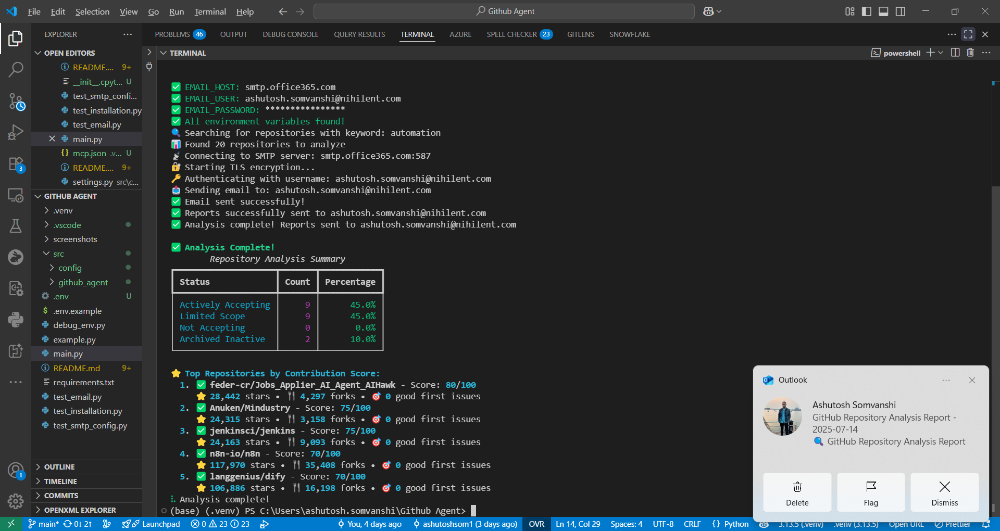
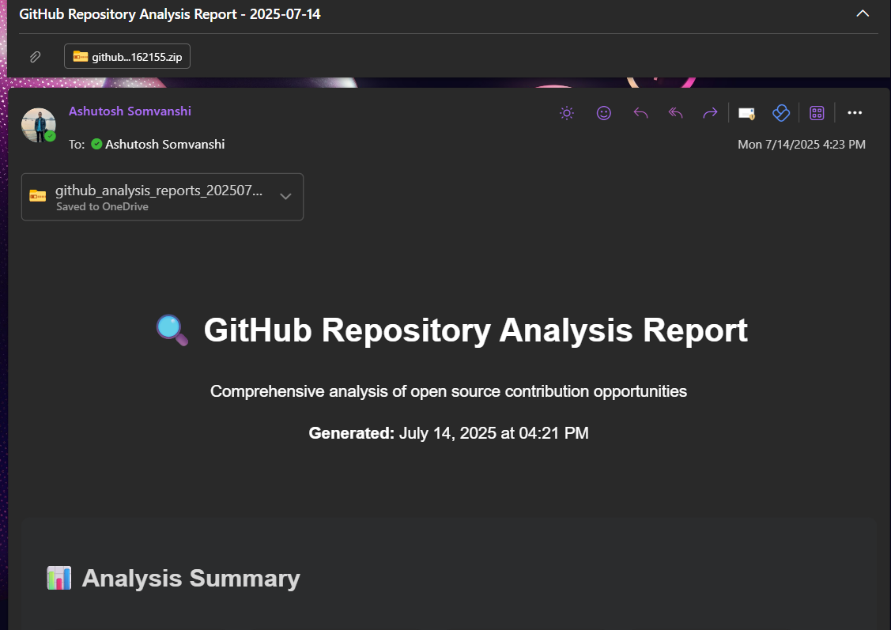
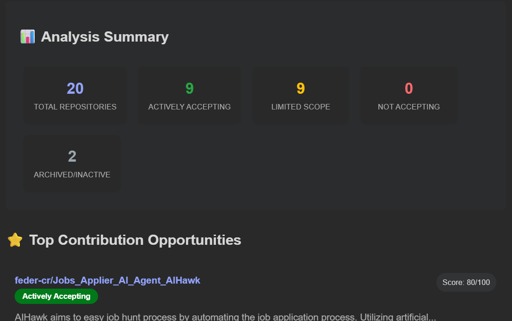
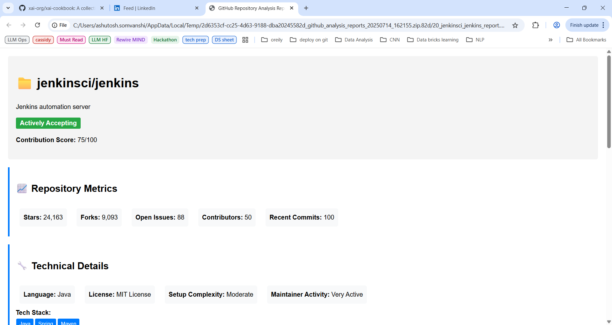

# GitHub Repository Analysis Agent

A comprehensive tool that scans top GitHub repositories based on keywords, analyzes their contribution status, and generates detailed technical reports for each repository.

## 🌟 Features

- **🔍 Repository Discovery**: Search top repositories by keywords using GitHub API
- **📊 Contribution Analysis**: Automatically classify repositories by contribution acceptance
- **📋 Technical Reporting**: Generate detailed reports for technical professionals
- **📧 Email Delivery**: Automated report distribution via email
- **⚡ Rate Limiting**: Smart API usage with caching and rate limiting
- **🎯 Contribution Scoring**: Advanced algorithm to score contribution opportunities
- **📱 Rich CLI Interface**: Beautiful command-line interface with progress tracking

## � Screenshots

### CLI Interface in Action

*Beautiful command-line interface with real-time progress tracking*

### Analysis Results

*Smart categorization of repositories by contribution readiness*

### Email Reports



*Comprehensive HTML reports delivered directly to your inbox*

## �🚀 Quick Start

### 1. Installation

```bash
# Clone the repository
git clone <your-repo-url>
cd "Github Agent"

# Install dependencies
pip install -r requirements.txt
```

### 2. Configuration

1. **Get a GitHub Personal Access Token**:
   - Go to GitHub Settings → Developer settings → Personal access tokens
   - Generate a new token with `public_repo` scope
   - Copy the token

2. **Set up Email Credentials**:
   - For Gmail, enable 2FA and create an App Password
   - For other providers, get SMTP credentials

3. **Create Environment File**:
   ```bash
   cp .env.example .env
   ```
   
   Edit `.env` with your credentials:
   ```
   GITHUB_TOKEN=ghp_your_github_token_here
   EMAIL_HOST=smtp.gmail.com
   EMAIL_PORT=587
   EMAIL_USER=your_email@gmail.com
   EMAIL_PASSWORD=your_app_password_here
   ```

### 3. Usage

#### Command Line Interface
```bash
# Analyze machine learning repositories
python main.py --keyword "machine learning" --email "recipient@example.com"

# Customize search parameters
python main.py -k "web development" -e "user@example.com" --max-repos 30 --min-stars 500
```

#### Python API
```python
import asyncio
from src.github_agent import GitHubAnalysisAgent

async def main():
    agent = GitHubAnalysisAgent()
    analyses = await agent.analyze_repositories(
        keyword="python", 
        recipient_email="user@example.com"
    )
    
    # Print results
    for analysis in analyses[:5]:
        print(f"{analysis.full_name} - Score: {analysis.contribution_score}/100")

asyncio.run(main())
```

## 📊 What You Get

### Email Report Contains:
- **Summary Dashboard**: Overview of all analyzed repositories
- **Contribution Status Distribution**: Visual breakdown of repository categories
- **Top Opportunities**: Highest-scoring repositories for contributions
- **Individual Reports**: Detailed analysis for each repository

### Individual Repository Reports Include:
- ✅ **Contribution Readiness Score** (0-100)
- 🎯 **Specific Recommendations** based on repository status
- 🚀 **Getting Started Guide** with step-by-step instructions
- 🔧 **Technical Requirements** and setup complexity
- 📈 **Maintainer Activity** and response time estimates
- 🏷️ **Issue Labels** for beginners (good-first-issue, help-wanted)
- 📝 **Contributing Guidelines** analysis

## 🏗️ Project Structure

```
Github Agent/
├── src/
│   ├── github_agent/
│   │   ├── __init__.py          # Main agent class
│   │   ├── api_client.py        # GitHub API wrapper
│   │   ├── analyzer.py          # Repository analysis logic
│   │   ├── report_generator.py  # HTML report generation
│   │   └── email_sender.py      # Email functionality
│   └── config/
│       └── settings.py          # Configuration management
├── main.py                      # CLI interface
├── example.py                   # Usage examples
├── requirements.txt             # Python dependencies
├── .env.example                 # Environment template
└── README.md                    # This file
```

## 🎯 Repository Classification

The agent classifies repositories into four categories:

1. **🟢 Actively Accepting** (Score: 70-100)
   - Has contributing guidelines
   - Good first issues available
   - Recent commit activity
   - Active maintainer responses

2. **🟡 Limited Scope** (Score: 40-69)
   - Some contribution opportunities
   - Moderate activity
   - May have specific requirements

3. **🔴 Not Accepting** (Score: 0-39)
   - No clear contribution process
   - Low activity
   - Minimal documentation

4. **⚪ Archived/Inactive** (Score: N/A)
   - Archived repositories
   - No recent activity

## ⚙️ Configuration Options

Environment variables you can set in `.env`:

```bash
# Required
GITHUB_TOKEN=your_token
EMAIL_HOST=smtp.gmail.com
EMAIL_USER=your_email@gmail.com
EMAIL_PASSWORD=your_password

# Optional
EMAIL_PORT=587                   # SMTP port (default: 587)
MAX_REPOSITORIES=50              # Max repos to analyze (default: 50)
MIN_STARS=100                    # Minimum stars filter (default: 100)
```

## 🔧 Advanced Usage

### Custom Analysis
```python
from src.github_agent.analyzer import RepositoryAnalyzer
from src.github_agent.api_client import GitHubAPIClient

# Analyze specific repositories
analyzer = RepositoryAnalyzer()
api_client = GitHubAPIClient()

# Custom search parameters
repositories = await api_client.search_repositories(
    keyword="rust programming", 
    sort="updated"
)
```

### Batch Processing
```python
keywords = ["machine learning", "web development", "data science"]
email = "analyst@company.com"

for keyword in keywords:
    await agent.analyze_repositories(keyword, email)
```

## 🎨 Sample Output

```
🔍 GitHub Repository Analysis Agent
Keyword: machine learning
Email: user@example.com
Max Repositories: 20
Min Stars: 100

📊 Found 20 repositories to analyze
✅ Analysis complete! Reports sent to user@example.com

✅ Analysis Complete!
┌─────────────────┬───────┬────────────┐
│ Status          │ Count │ Percentage │
├─────────────────┼───────┼────────────┤
│ Actively Accept │   12  │    60.0%   │
│ Limited Scope   │    5  │    25.0%   │
│ Not Accepting   │    2  │    10.0%   │
│ Archived Inact  │    1  │     5.0%   │
└─────────────────┴───────┴────────────┘

⭐ Top Repositories by Contribution Score:
  1. ✅ scikit-learn/scikit-learn - Score: 95/100
     ⭐ 52,847 stars • 🍴 23,495 forks • 🎯 45 good first issues
  2. ✅ tensorflow/tensorflow - Score: 88/100
     ⭐ 176,543 stars • 🍴 88,432 forks • 🎯 23 good first issues
```

## 🤝 Contributing

1. Fork the repository
2. Create a feature branch
3. Make your changes
4. Add tests if applicable
5. Submit a pull request

## 📄 License

This project is licensed under the MIT License - see the LICENSE file for details.

## 🆘 Troubleshooting

### Common Issues:

1. **GitHub API Rate Limiting**:
   - The tool automatically handles rate limits
   - Use a personal access token for higher limits

2. **Email Authentication Errors**:
   - For Gmail, use an App Password, not your regular password
   - Enable 2FA first, then generate an App Password

3. **Missing Dependencies**:
   ```bash
   pip install --upgrade pip
   pip install -r requirements.txt
   ```

4. **Environment Variables Not Loading**:
   - Ensure `.env` file is in the project root
   - Check for typos in variable names

### Support

For issues and questions:
- Create an issue on GitHub
- Check existing issues for solutions
- Review the example.py file for usage patterns
